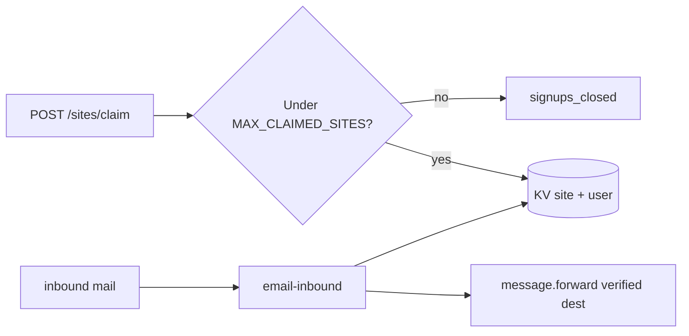
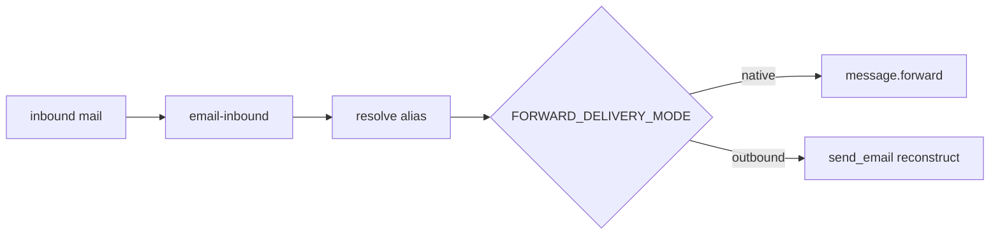

# ADR-0007: Hosted capacity limits and email forwarding scale

- Status: Accepted
- Date: 2026-09-16
- Deciders: Project maintainers
- Technical Story: Hosted `is-in.nz` economics — Cloudflare verified-destination cap, Workers Paid migration path, controlled sign-ups
- Supersedes:
- Superseded by:

## Context

Hosted multi-tenant `is-in.nz` offers email forwarding via inbound Email Routing and `workers/email-inbound`, which calls `message.forward()` to user-configured destinations stored in KV (`emailAliases`).

Cloudflare enforces **200 verified destination addresses per account** (shared across all zones). Each unique external inbox used as a forward target consumes one slot after the user completes Cloudflare’s destination verification flow. Catch-all routing → one Email Worker avoids the separate **200 routing rules per domain** limit, but does **not** avoid the destination cap.

Separately, public sign-in currently uses outbound OTP via the `send_email` binding, which requires **Workers Paid** for arbitrary recipients. Inbound forwarding does not require Paid, but scaling forwarding past ~200 unique targets requires a different delivery mechanism (outbound re-send).

The product should launch within Cloudflare’s free routing model where possible, plan an explicit migration to outbound forwarding at scale, and expose **operator-controlled sign-up limits** so growth stays within verified-destination and cost envelopes.

## Decision Drivers

- Honest scope and longevity (do not silently break forwarding at user 201)
- Cloudflare-only infrastructure (no third-party mail vendors)
- Self-serve hosted operation without manual per-user routing rules
- Minimal change to existing KV site model and catch-all Email Routing topology
- Ability to pause or cap sign-ups before hard platform limits or cost cliffs

## Options Considered

### Option 1: Rely on Cloudflare limit-increase requests only

Request higher verified-destination limits via Cloudflare’s form; continue `message.forward()` indefinitely.

Pros:

- Smallest code change

Cons:

- Not self-serve; no guaranteed SLA; poor fit for “forwarding as a service”
- Does not address OTP / outbound auth economics

### Option 2: Phased delivery — native forward, then outbound re-send (chosen)

**Phase A (launch):** Keep `message.forward()`. Track platform capacity in KV. Gate claims and/or new forward destinations against configurable limits below Cloudflare’s 200 cap.

**Phase B (scale):** Add `FORWARD_DELIVERY_MODE=outbound` on `email-inbound`. On inbound mail, read destination from KV and deliver via `send_email` to arbitrary addresses (requires Workers Paid + Email Sending domain onboarding). Deprecate dependence on per-user verified routing destinations for delivery.

Pros:

- Launch on free inbound routing; migrate deliberately
- Sign-up caps protect Phase A; Phase B removes destination ceiling
- Same worker topology (catch-all → Email Worker)

Cons:

- Phase B changes deliverability semantics (re-sent mail vs native forward)
- Phase B ties forwarding volume to Email Sending quota and Workers Paid cost
- Requires a mail reconstruction path (headers, `Reply-To`, attachments policy)

### Option 3: Drop hosted email forwarding

Profiles and short links only on hosted tier; forwarding self-host only.

Pros:

- Avoids scale cliff entirely

Cons:

- Contradicts core product bundle in README

## Decision

Adopt **Option 2**: phased forwarding delivery with **platform capacity controls** on the management API.

### In scope

1. **Platform capacity configuration** via Wrangler vars (and optional KV counters)
2. **Claim-time sign-up gate** (`POST /api/v1/sites/claim`)
3. **Forward-destination capacity tracking** for unique external addresses across all sites
4. **`FORWARD_DELIVERY_MODE`** on `email-inbound`: `native` (default) | `outbound`
5. **Outbound forwarder implementation** (Phase B) using `send_email`, behind the mode flag
6. **Documentation** of limits in README and operator runbook

### Out of scope (for this ADR)

- Third-party transactional email (Resend, etc.)
- OAuth sign-in (separate decision)
- Per-user paid tiers or billing
- Automatic Cloudflare destination verification API integration (may follow; manual/dashboard verification acceptable for Phase A MVP)
- Site deletion and counter decrement (until delete exists, treat claims as monotonic)

## Architecture

### Phase A — native forward (launch)

- **Sign-up cap:** `MAX_CLAIMED_SITES` (optional integer). When set and `count(sites) >= cap`, claim returns `503` with `{ "error": "signups_closed" }`. UI shows a clear “full for now” message.
- **Sign-up enabled:** `SIGNUPS_ENABLED=true|false` (default `true` when unset). `false` rejects all new claims regardless of count (maintenance / waitlist prep).
- **Forward destination cap:** `MAX_UNIQUE_FORWARD_DESTINATIONS` (optional, default unset). Before accepting a new unique destination in `PATCH .../forwarding` or alias POST, check a platform registry; reject with `{ "error": "forward_capacity_full" }` when at cap. Hosted default: **150** (same envelope as sign-ups; leaves headroom under Cloudflare’s 200 verified-destination cap).
- **Registry:** KV key `platform:forward_destinations` — JSON set of canonical destination emails in use, maintained on forward PATCH/alias write (add on new unique dest; remove when no site references it — best-effort when alias cleared).

Site count: KV key `platform:stats` with `{ "claimedSites": N }` incremented atomically on successful claim (or env-only cap with periodic operator audit if counter deferred).

### Phase B — outbound re-send (scale)

- Enable Workers Paid; onboard `is-in.nz` for **Email Sending**.
- Bind `send_email` on `email-inbound` (or shared mailer module).
- Reconstruct forward: preserve `From` / `Reply-To` / subject / body per Cloudflare Email Worker APIs; document attachment size policy (≤ outbound content limits).
- **`MAX_UNIQUE_FORWARD_DESTINATIONS`:** optional in outbound mode (quota-driven instead of verification-driven); may raise or remove when native verification no longer gates delivery.
- Monitor send volume against included 3,000/mo and overage.

### Migration path

1. Ship Phase A caps and registry with `FORWARD_DELIVERY_MODE=native`.
2. Operate until approaching cap or Cloudflare limit-increase ceiling; communicate to users.
3. Enable Paid + Email Sending; test `outbound` in staging.
4. Flip production to `outbound`; keep registry for analytics; relax or remove destination cap.
5. Optionally retain `native` for self-host deployments without Paid.

## Sign-up limiting (concrete behaviour)

| Control | Var | Effect |
| -------- | --- | ------ |
| Hard close | `SIGNUPS_ENABLED=false` | All claims rejected |
| Numeric cap | `MAX_CLAIMED_SITES=N` | Reject when `claimedSites >= N` |
| Forward cap | `MAX_UNIQUE_FORWARD_DESTINATIONS=M` | Block new unique forward targets (claims may still succeed) |
| Existing | `SUBDOMAIN_MODERATION=on` | Name policy only; not a quantity limit |

**Hosted launch defaults (decided):**

| Var | Value | Rationale |
| --- | --- | --- |
| `MAX_CLAIMED_SITES` | **150** | Scarcity positioning; stays under Cloudflare’s 200 destination ceiling with headroom |
| `MAX_UNIQUE_FORWARD_DESTINATIONS` | **150** | Same envelope; one forward target per user is the common case |
| `SIGNUPS_ENABLED` | `true` until full | Set to `false` for maintenance without changing the cap |

**Workers Paid trigger:** at ~150 active hosted sites, enabling Workers Paid (~$5/mo) for `send_email` is justified — OTP to arbitrary sign-up addresses, and later outbound forwarding (Phase B) when native `message.forward()` limits bite. Treat Paid as the “hosted platform is real” threshold, not an emergency cost.

**API errors (stable codes):**

- `signups_closed` — mode closed or site cap reached
- `forward_capacity_full` — unique destination cap reached

**UI:** `/claim` and forwarding forms surface human copy; no silent failures.

## Consequences

### Positive

- Predictable launch within Cloudflare free routing constraints
- Clear operator levers without code deploy for every pause (Wrangler vars)
- Documented path to scale without third-party mail
- Aligns with “honest scope” product value

### Negative

- Phase B outbound forwards are operationally heavier than `message.forward()`
- Registry and counters add consistency work (claim vs forward PATCH ordering)
- Workers Paid becomes likely for both auth OTP and scaled forwarding

### Neutral

- ADR-0005 remains valid for Phase A; add cross-reference to this ADR for scale
- ADR-0001 OTP economics unchanged; Paid plan may cover OTP + forwarding together

## Implementation Notes

- Add vars to `ManagementEnv`, `email-inbound` `Env`, and wrangler examples.
- Implement `platformStats` / `forwardDestinationRegistry` helpers in `@is-in/shared` or management server.
- Claim handler: check caps after auth, before moderation, before KV write.
- Forward handlers: on new unique destination, registry insert; enforce cap.
- `email-inbound`: branch on `FORWARD_DELIVERY_MODE`; extract deliver function for testing.
- Self-host: leave caps unset (unlimited claims); `native` mode only.

## Validation

- Unit tests: claim rejected when `SIGNUPS_ENABLED=false` or at `MAX_CLAIMED_SITES`
- Unit tests: forward PATCH rejected at `MAX_UNIQUE_FORWARD_DESTINATIONS`
- Integration: staging native forward still works under cap
- Integration: staging `outbound` delivers to unverified-in-routing address when Paid + sending enabled
- README table updated for operator capacity vars

## References

- [ADR-0005](ADR-0005-inbound-email-forwarding.md)
- [ADR-0001](ADR-0001-otp-email-service.md)
- https://developers.cloudflare.com/email-routing/limits/
- `workers/email-inbound/src/index.ts`
- `apps/management/src/server/handlers/sites.ts`
