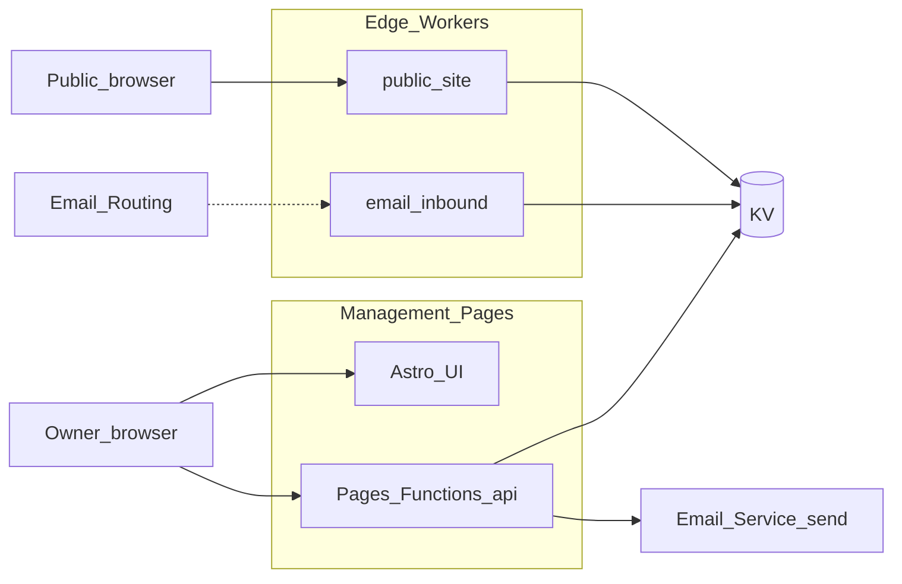

# is-in.nz

A single hostname that stays yours: a profile strangers can open, short links you can change when the destination moves, and addresses at `something@username.is-in.nz` that land in inboxes you already use. That bundle is the whole product idea — no generic website hosting, no social feed, just a small set of behaviours you configure once and keep.

We keep the HTML and routing boring on purpose so the interesting part is what you bring: typography and layout through CSS, where your short links point, and who receives mail for your subdomain. Delivery stays edge-close ([Cloudflare Workers](https://developers.cloudflare.com/workers/) with KV) so the thing you operate stays small.

## Values

- **Longevity over novelty.** Prefer plain, dependable building blocks that stay affordable to run and trustworthy year on year—technology and habits you can imagine keeping up for decades, not just until the next stack fashion cycle.
- **Creative room, bounded risk.** Give people meaningful sway (especially how a page reads and where links land) inside structures that keep visitors safe from arbitrary scripts and opaque bundles.
- **Respect for attention.** Small number of sharp surfaces, quick setup, low cognitive load—running a subdomain should not feel like a second job.
- **Honest scope.** Say no to whole categories (generic hosting, social graphs, deep org tooling) rather than half-ship them and let them quietly rot.

## How we think about it

- **No JavaScript in visitor-facing content.** Expression is CSS and structured fields, not arbitrary scripts—safer for readers and clearer about what’s possible.
- **Structured knobs, not a blank VM.** You don’t upload a build artefact; you fill in data the platform knows how to render and route.
- **Subdomains as objects.** A name under `is-in.nz` is a thing with a profile, redirect table, and mail routes—not a raw server you have to manage and harden yourself.

## Under your subdomain

### Profile pages

`https://username.is-in.nz`

Public page: custom CSS (no JavaScript), avatar, bio, labelled outbound links, plus a status line and timestamped history. The page shape is fixed; you own how it reads visually. Rendering stays safe—no script injection.

### Short links

`https://username.is-in.nz/go/example`

Redirects you control: HTTP 301/302, optional expiry and title metadata, QR codes per link, path-style routes. Useful for bios, events, print, or anything you might want to repoint without reprinting.

### Email forwarding

`anything@username.is-in.nz`

Aliases (including `*@username.is-in.nz`) forward to external addresses. Forwarding only—no mailbox hosting—and destinations must be verified.

## Architecture (implemented baseline)

- **`apps/management`** — Astro **hybrid** app on Cloudflare Pages: prerendered UI (intended `home.is-in.nz`) plus **Pages Functions** at `/api/*` for availability, OTP, session, claim, and forwarding PATCH. Binds **KV** and Cloudflare **Email Service** (`send_email`) via [`apps/management/wrangler.toml`](apps/management/wrangler.toml).
- **`workers/public-site`** — Minimal Hono worker for `https://{site}.is-in.nz`: reads `webForwardUrl` from KV and issues HTTP redirects (or a short plain message if unset).
- **`workers/email-inbound`** — Minimal **Email Worker**: resolves `*@{site}.is-in.nz` against KV `site:{site}` and `message.forward(emailForwardDest)` when set. Wire it in **Email Routing** after deploy.
- **Cloudflare Pages** — `pnpm build:management` then `wrangler pages deploy` from `apps/management` (see [`scripts/deploy-pages.sh`](scripts/deploy-pages.sh)).



## Hostnames and environments (multi-stage)

Use one Cloudflare account with **Wrangler environments** and **separate KV namespace IDs** per env (see [ADR-0006](docs/architectural-decision-records/ADR-0006-staging-environments.md)). Use the **same KV binding IDs** on the Pages project (`apps/management/wrangler.toml`), `workers/public-site`, and `workers/email-inbound` so site records are shared.

| Environment | Management (Pages + `/api`)                                   | Public HTTP worker                   | Inbound mail worker             |
| ----------- | ------------------------------------------------------------- | ------------------------------------ | ------------------------------- |
| Production  | `home.is-in.nz`                                               | `*.is-in.nz` → `public-site`         | Email Routing → `email-inbound` |
| Staging     | `test.is-in.nz` (dashboard + `/api`)                          | `*.test.is-in.nz` → `public-site`    | Staging worker + **staging KV** |

**Build-time:** `PUBLIC_API_BASE` is optional. Leave it empty so the UI calls **same-origin** `/api/...`. Set it only if the HTML is ever served from a different origin than the API.

**No CORS allowlist** is required for the default same-host setup.

## Secrets and local development

1. **`SESSION_SECRET`:** copy [`apps/management/.dev.vars.example`](apps/management/.dev.vars.example) to `apps/management/.dev.vars` (required for all `/api/*` routes). Without it, API calls return `{"error":"server_misconfigured"}`. Deployed: `cd apps/management && wrangler secret put SESSION_SECRET` (and `-e staging` for staging).
2. **KV IDs:** create namespaces with `wrangler kv namespace create "is-in-kv"` (and a staging twin). Paste IDs into **`apps/management/wrangler.toml`**, **`workers/public-site/wrangler.toml`**, and **`workers/email-inbound/wrangler.toml`** for each environment.
3. **Routes:** point `*.is-in.nz` (excluding `home*`) at `public-site`. Attach `email-inbound` to Email Routing rules for the subdomain addresses you want dynamically forwarded.

## Cloudflare Email Service (OTP)

Outbound sign-in codes use the [`send_email` binding](https://developers.cloudflare.com/email-service/api/send-emails/workers-api/) on the **Pages** project (`apps/management/wrangler.toml`). Before production:

1. Onboard and verify the sender domain in **Cloudflare Email Service**.
2. Align `OTP_FROM` in `wrangler.toml` with a verified sender on that domain.
3. Confirm daily and rate limits fit expected OTP volume on your plan.

**Local OTP testing:** `astro dev` (`pnpm dev:management`) does not expose the `send_email` binding. Use **`pnpm dev:management:pages`** (build + `wrangler pages dev`) instead. After sign-in, Wrangler logs a path to a local file containing the simulated email body (including the numeric code). See [Email sending — local development](https://developers.cloudflare.com/email-service/local-development/sending/).

If Email Service cannot be enabled on the zone, follow the fallback order in [ADR-0001](docs/architectural-decision-records/ADR-0001-otp-email-service.md).

## Email forwarding destination (MVP)

Saving a destination in the dashboard writes `emailForwardDest` on the site record in KV. **`workers/email-inbound`** forwards matching inbound mail when Email Routing delivers to that worker. You still need correct **MX / Email Routing** on the zone—see [ADR-0005](docs/architectural-decision-records/ADR-0005-inbound-email-forwarding.md).

## Monorepo commands

Requires [pnpm](https://pnpm.io/) (version aligned with [`package.json`](package.json) `packageManager` field).

```bash
pnpm install
pnpm verify                 # lint + typecheck + test (run before PRs)
pnpm typecheck
pnpm test
pnpm test:watch             # Vitest watch mode
pnpm dev:public-site
pnpm dev:email-inbound
pnpm dev:management          # Astro dev — UI + API; no OTP email (send_email not in platform proxy)
pnpm dev:management:pages    # Build + wrangler pages dev — use for OTP / email testing
pnpm build:management
```

Deploy the management app (UI + API):

```bash
pnpm deploy:management              # production (home.is-in.nz)
pnpm deploy:management:staging      # staging (test.is-in.nz)
# or: ./scripts/deploy-management.sh [production|staging]
```

Staging uses `ROOT_DOMAIN=test.is-in.nz` so claimed names are `you.test.is-in.nz`. The dashboard is at the apex `test.is-in.nz`. Set `PUBLIC_ROOT_DOMAIN` at build time via the deploy script (do not rely on `wrangler deploy -e staging` alone with Astro 6).

Deploy edge workers:

```bash
pnpm --filter public-site deploy
pnpm --filter email-inbound deploy
# staging (*.test.is-in.nz — configure Email Routing for mail):
pnpm --filter public-site deploy:staging
pnpm --filter email-inbound deploy:staging
```

## Development

- **Lint and format:** [Biome](https://biomejs.dev/) at the repo root (`pnpm lint`, `pnpm lint:fix`). Install the [Biome VS Code extension](https://biomejs.dev/reference/vscode/) for format-on-save.
- **Tests:** [Vitest](https://vitest.dev/) (`pnpm test`). Shared validation logic and management server helpers use the Node pool; the `public-site` worker uses `@cloudflare/vitest-pool-workers`.
- **Single workspace:** `pnpm --filter @is-in/shared test` runs tests for one package.

See [`docs/development.md`](docs/development.md) for CI, security scanning, and conventions for new tests.

## Conceptual data model

Each **user** ties an email address to one or more subdomains (MVP UI assumes one site per user; KV allows a list).

Each **subdomain** owns structured fields in KV (profile and `/go` routes are not implemented in this milestone).

## What we are not building

- No JavaScript execution on end-user profile pages.
- No general-purpose web hosting or arbitrary file uploads.
- No social network (feeds, followers, likes).
- No teams or org hierarchies.
- No password-based sign-in.
- No “edit every DNS record” control panel for the shared zone.

## Abuse and safety posture

- Structured data only—no raw HTML or user-controlled scripts in content surfaces.
- Rate limits on creates and updates.
- Verified email for ownership-sensitive actions.
- Careful validation of redirect targets.
- Reserved system namespaces so the platform can breathe.
- Cooldowns on sensitive changes so panic clicks do less damage.

## Target experience

You should be able to get something meaningful live quickly, feel ownership over a coherent little space, enjoy real leeway in how it looks (within the CSS-only rule), and not need a manual the size of a novella to keep it updated.

## Project status

Reserve-address onboarding, the Pages-hosted control API (`/api/*`), the public redirect worker, the inbound email worker, and the Astro management app are in this repo. Profile pages, `/go` short links, and fully automated Email Routing rule creation are still to come.

## Documentation

- **Development:** [`docs/development.md`](docs/development.md)
- **Product brief:** [`docs/init/PLAN.md`](docs/init/PLAN.md)
- **ADRs:** [`docs/architectural-decision-records/`](docs/architectural-decision-records/) — ADR-0001 … ADR-0006 for OTP, sessions, KV, workers, email MVP, staging
