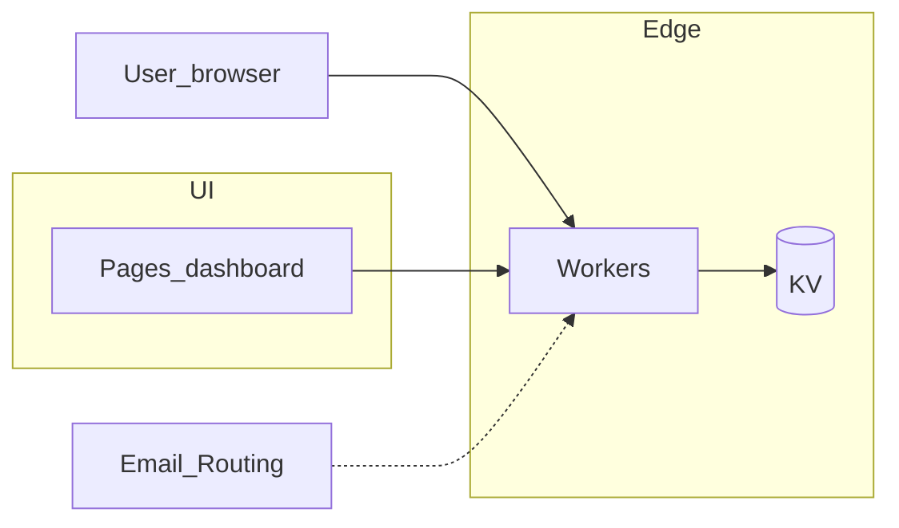

# is-in.nz

A single hostname that stays yours: a profile strangers can open, short links you can change when the destination moves, and addresses at `something@username.is-in.nz` that land in inboxes you already use. That bundle is the whole product idea — no generic website hosting, no social feed, just a small set of behaviours you configure once and keep.

We keep the HTML and routing boring on purpose so the interesting part is what you bring: typography and layout through CSS, where your short links point, and who receives mail for your subdomain. Delivery stays edge-close ([Cloudflare Workers](https://workers.cloudflare.com/) with KV) so the thing you operate stays small.

## Values

- **Longevity over novelty.** Prefer plain, dependable building blocks that stay affordable to run and trustworthy year on year—technology and habits you can imagine keeping up for decades, not just until the next stack fashion cycle.
- **Creative room, bounded risk.** Give people meaningful sway (especially how a page reads and where links land) inside structures that keep visitors safe from arbitrary scripts and opaque bundles.
- **Respect for attention.** Small number of sharp surfaces, quick setup, low cognitive load—running a subdomain should not feel like a second job.
- **Honest scope.** Say no to whole categories (generic hosting, social graphs, deep org tooling) rather than half-ship them and let them quietly rot.

## How we think about it

- **No JavaScript in visitor-facing content.** Expression is CSS and structured fields, not arbitrary scripts—safer for readers and clearer about what’s possible.
- **Structured knobs, not a blank VM.** You don’t upload a build artefact; you fill in data the platform knows how to render and route.
- **Subdomains as objects.** A name under `is-in.nz` is a thing with a profile, redirect table, and mail routes—not a raw server you have to manage and harden yourself.

## Under your subdomain

### Profile pages

`https://username.is-in.nz`

Public page: custom CSS (no JavaScript), avatar, bio, labelled outbound links, plus a status line and timestamped history. The page shape is fixed; you own how it reads visually. Rendering stays safe—no script injection.

### Short links

`https://username.is-in.nz/go/example`

Redirects you control: HTTP 301/302, optional expiry and title metadata, QR codes per link, path-style routes. Useful for bios, events, print, or anything you might want to repoint without reprinting.

### Email forwarding

`anything@username.is-in.nz`

Aliases (including `*@username.is-in.nz`) forward to external addresses. Forwarding only—no mailbox hosting—and destinations must be verified.

## Architecture (high level)

- **Cloudflare Workers** — HTTP handling, redirect resolution, profile rendering, and the rest of the edge logic.
- **Cloudflare KV** — state.
- **Cloudflare Pages** — owner dashboard.
- **Email Routing** — forwarding plumbing for addresses on your subdomain.
- **Dashboard access** — passwordless, email-based session establishment (signed links, cookies) lives here too; it’s ordinary web app mechanics, not something visitors “use” as a product surface.

The dashed edge to **Email_Routing** is intentional: Workers and routing integrate, but the wiring will get sharper as the repo grows past planning.

## Conceptual data model

Each **user** ties an email address to one or more subdomains.

Each **subdomain** owns:

- **profile** — bio, avatar, current status, `status_history[]`, `links[]`
- **redirects[]** — short-link definitions
- **email_routes[]** — forwarding rules

## What we are not building

- No JavaScript execution on end-user profile pages.
- No general-purpose web hosting or arbitrary file uploads.
- No social network (feeds, followers, likes).
- No teams or org hierarchies.
- No password-based sign-in.
- No “edit every DNS record” control panel for the shared zone.

## Abuse and safety posture

- Structured data only—no raw HTML or user-controlled scripts in content surfaces.
- Rate limits on creates and updates.
- Verified email for ownership-sensitive actions.
- Careful validation of redirect targets.
- Reserved system namespaces so the platform can breathe.
- Cooldowns on sensitive changes so panic clicks do less damage.

## Target experience

You should be able to get something meaningful live quickly, feel ownership over a coherent little space, enjoy real leeway in how it looks (within the CSS-only rule), and not need a manual the size of a novella to keep it updated.

## Project status

This repository is still mostly intent: the detailed brief is [`docs/init/PLAN.md`](docs/init/PLAN.md), and Workers, schema, and dashboard code are not here yet. There is no install or run script—this file is the map, not the engine.

## Documentation

- **Product brief:** [`docs/init/PLAN.md`](docs/init/PLAN.md)
- **Architecture decisions:** [`docs/architectural-decision-records/`](docs/architectural-decision-records/) (template in place for future ADRs)
